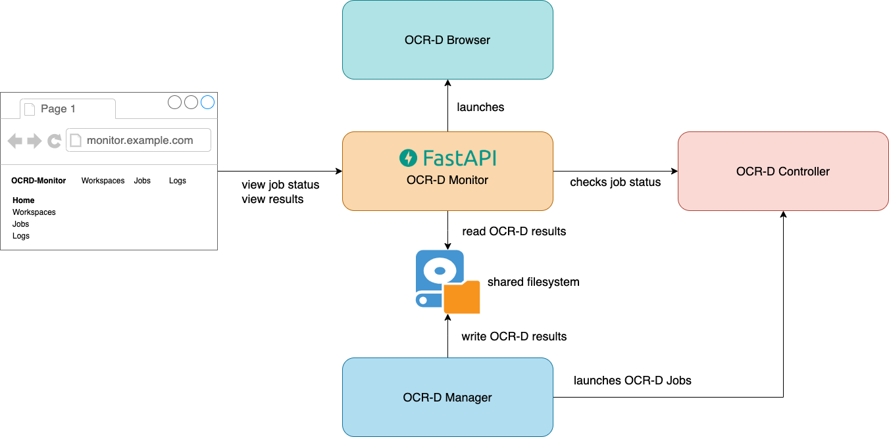

# OCR-D Monitor

The OCR-D Monitor web application allows monitoring the progress and results of OCR-D jobs.
It is intended to be used together with the setup found in the [ocrd_kitodo repository](https://github.com/slub/ocrd_kitodo).
You can find detailed instructions on how to deploy the entire Kitodo-OCR-D stack there.

In order to work properly, the following environment variables must be set:

| Variable            | Description                                                                      |
| ------------------- | -------------------------------------------------------------------------------- |
| CONTROLLER_HOST     | Hostname of the OCR-D Controller                                                 |
| CONTROLLER_PORT_SSH | Port on the OCR-D Controller host that allows a SSH connection                   |
| MANAGER_DATA        | Path to the OCR-D workspaces on the host                                         |
| MANAGER_KEY         | Path to a private key that can be used to authenticate with the OCR-D Controller |
| MONITOR_PORT_WEB    | The port at which the OCR-D Monitor will be available on the host                |
| MONITOR_PORT_LOG    | The port at which the Dozzle logs will be available on the host                  |

## Testing

The tests are intended to be run outside of a container, as some of them will set up containers themselves.
Therefore you need to have a Python version >= 3.9 installed on your system.

1. Install runtime and dev dependencies

```bash
    pip install -r requirements.txt
    pip install -r requirements.dev.txt
```

2. Run nox or pytest

```bash
    nox
```

```bash
    pytest tests
```

## General overview



## Overview of workspaces endpoint functionality

When opening a workspace OCR-D Monitor will launch a new `OcrdBrowser` instance (either as a Docker container or a sub process).
From there on it will proxy requests to the `/workspaces/view/<path>` endpoint to the browser instance.


